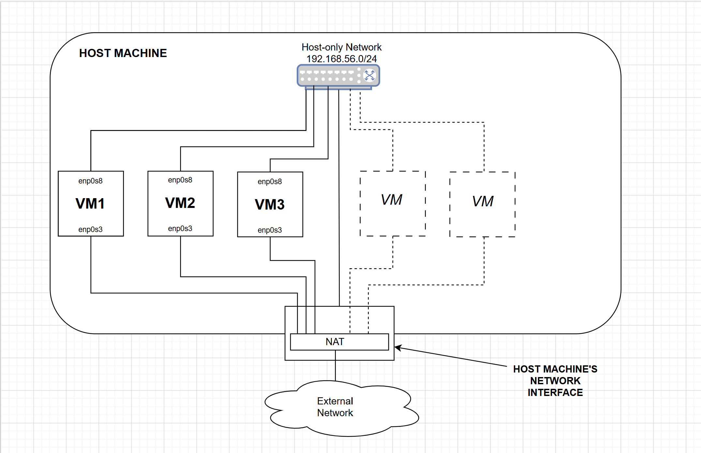

# packer-virtualbox-rhel10
A [Packer](https://developer.hashicorp.com/packer) [HCL template](https://developer.hashicorp.com/packer/docs/templates/hcl_templates) file for the automated creation of virtual machines (VMs) running [Red Hat Enterprise Linux 10 (RHEL10)](https://www.redhat.com/en/technologies/linux-platforms/enterprise-linux-10).  It works with a [Kickstart](https://en.wikipedia.org/wiki/Kickstart_(Linux)) file to install of RHEL10 according to certain desired settings. 

## Overview
I have developed (and tested) a Packer HCL template file, `rhel10.pkr.hcl`, that works in conjunction with the [Packer VirtualBox plugin](https://developer.hashicorp.com/packer/integrations/hashicorp/virtualbox) and a custom Kickstart file, `ks.cfg` for the automated creation  of RHEL10-based VM image templates.

Packer uses these files to build standardised VM templates in [OVF or OVA formats](https://en.wikipedia.org/wiki/Open_Virtualization_Format) that can then be imported into VirtualBox (or any other supported hypervisor such as [VMWare](https://www.vmware.com/)) for the creation of RHEL10-based VMs with  preferred pre-baked settings.

### Motivation
Quite often, there is a need to spin up multiple VMs quickly on a host machine to a standard configuration when setting up labs, experimenting, testing, etc.  

Furthermore, when running multi-VM labs on a development machine it's considered "best practice" to configure each VM with two network adapters. One network adapter attached to the hypervisor's [NAT](https://www.virtualbox.org/manual/ch06.html#network_nat) network to allow the VMs to access the external network and the Internet (e.g. for software updates), and the other network adapter attached to an internal [Host-Only](https://www.virtualbox.org/manual/ch06.html#network_hostonly) hypervisor network for isolated VM-to-VM, as well as Host-to-VM communications.  The Packer template and Kickstart files provided here creates this configuration, which is shown schematically in the diagram below:





Setting up VMs manually according to this particular configuration takes considerable time.  The Packer template provided here saves time in automating this process while also avoiding some of the drawbacks of trying to do this with Vagrant. 
 
## Prerequisites
In order to use these files to build RHEL10-based VM templates, the following is preferably needed on the host machine:

- [x] The latest version of [Oracle VirtualBox](https://www.virtualbox.org/) (version 7.2.8r173730 was used at the time).  Also, ensure that the VirtualBox `VBoxManage` command is available on your `PATH` on the host machine.

- [x] The latest version of [Packer](https://developer.hashicorp.com/packer/install) (version 1.15.4 was used at the time).  Also, ensure that the `packer` command is available on your `PATH` on the host machine.
 
- [x] The latest version of the [Packer Plugin for VirtualBox](https://developer.hashicorp.com/packer/integrations/hashicorp/virtualbox) (version v1.1.2 was used at the time).

- [x] As ISO file for installing RHEL10, or any compatible distribution. A [Rocky Linux](https://rockylinux.org/) 10.2 ISO was used at the time of testing.  **NOTE:** Some of the most recent RHEL10-based distributions only support the newer **x86-64-v3** microarchitecture level as a minimum, so the underlying hardware on your host machine and installed hypervisor will need to support this.

- [x] The `rhel10.pkr.hcl` file should be updated with the SHA256 checksum value of the above ISO, as well as any other preferred settings such as the static IP address to use for the VM on the **host-only** network and optional settings for the "ansible" user (if Ansible is intended to be used with the VM).


## Running the Packer build
On the host machine meeting the above prerequisites:

1. Create an empty directory.

2. Copy / clone this repo into that directory.  At a minimum, you'll need the `rhel10.pkr.hcl` and `ks.cfg` files, with the latter in a separate subdirectory called `http`.

3. Download the ISO file into the same directory as the `rhel10.pkr.hcl` file.  The ISO can be any RHEL10-compatible distribution such as [Rocky Linux 10](https://rockylinux.org/news/rocky-linux-10-0-ga-release), [Alma Linux 10](https://almalinux.org/blog/2025-05-27-welcoming-almalinux-10/), [Oracle Linux 10](https://blogs.oracle.com/linux/oracle-linux-10-now-generally-available), [CentOS Stream 10](https://www.centos.org/centos10/).

4. If desired, edit the settings in `rhel10.pkr.hcl` according to your requirements.  (For an explanation of the settings see the *Notes on the Configuration* below).

5. Open a command prompt in the directory where the `rhel10.pkr.hcl` exists, the directory contents should look something like the following:

    ```
     <dir>/
       ├── rhel10.pkr.hcl
       ├── http/
       │     └── ks.cfg
       └── Rocky-10.2-x86_64-dvd1.iso
    ```

6. Validate the packer template file by running the command:

    ```sh 
    packer validate rocky10.pkr.hcl
    ```

7. If the file is validated successfully, run the build command to build the VM template:

    ```sh 
    packer build rocky10.pkr.hcl
    ```
  
    ***TIP** - if you want to build with a different variable settings, you can use the `-var` flag to override the default settings, e.g:*

    ```sh 
    packer build -var 'setup_ansible=true' rocky10.pkr.hcl
    ``` 

8. If the build is successful, it will create an OVF virtual machine template in an `output-${var.vm_name}` directory, e.g.:

    ```
    <dir>/
      ├── rhel10.pkr.hcl
      ├── http/
      │     └── ks.cfg
      ├── Rocky-10.2-x86_64-dvd1.iso
      │
      └── output-rhel10vm/
              ├── rocky10b.ovf
              └── rocky10b-disk001.vmdk
    ```


9. The OVF template can now be imported into VirtualBox (or any compatible hypervisor).  For VirtualBox, this can be done using the UI or on the command-line by running:

    ```sh 
    VBoxManage import <dir>\output-rhel10vm\rhel10a.ovf
    ```


## Notes on the Configuration
Here's a summary of the configuration created by the Packer and Kickstart files.  (By tweaking these settings you can create your own custom pre-baked VM configurations).

### Packer template file `rhel10.pkr.hcl`:

#### Variables
The file contains a number of default variable settings that can be changed by editing the template file or be overridden on the command-line when running the `packer build` command.

| Variable  | Default Value | Description |
| ----------| --------------| -------- |
| `vm_name` | `rhel10vm` | Name of the VM  |
| `host_name` | `rhel10host` | O.S name of VM |
| `iso_url` | `./Rocky-10.2-x86_64-dvd1.iso` | Path to RHEL10 ISO |
| `iso_checksum256` | <*SHA256 checksum for the Rocky Linux 10.2 dvd ISO*> | SHA256 checksum of the above ISO |
| `hostonly_nic` | `enp0s8`    | VM Network Adapter interface on the **Host-Only** network |
| `hostonly_ip` | `192.168.56.15/24` | IP address in CIDR format for Network Adapter interface on the **Host-Only** network  |
| `setup_ansible` | `false` | Boolean to determine whether to set up an 'ansible' user on the VM |
| `ansible_userid` | `ansible` | User name of the ansible user (if using Ansible) |
| `ansible_public_key` | <*REPLACE!*> |  Ansible user's SSH public key (if using Ansible), replace with your own value. |


#### The `source` block
Includes settings for creating the VM and installing the O.S. With these settings you can specify things like CPU, memory, disk, graphics card, etc.  

***NOTE:** The default **NAT** and **Host-only** Networks that come out-of-the-box with VirtualBox are used when configuring the VM's network adapters.  If you wish to use your own custom VM Networks, then the network settings under the `vboxmanage` block will need to be amended.*

#### The `build` block includes various [Packer Provisioners](https://developer.hashicorp.com/packer/docs/provisioners) for updating the installed O.S. such as:

- Changing the **host-only** network adapter interface from DHCP to static IP addressing.
- Updating the O.S. hostname.
- Updating installed packages.
- (Optionally) creating an Ansible user for managing the VM with Ansible.
- Copying a file to the O.S. using the file provisioner (what is provided here with `Computer_Notice.md` is just a superficial example).


### The Kickstart file `ks.cfg`:
The Packer template file `rhel10.pkr.hcl` expects to find the Kickstart file `ks.cfg` in the subdirectory `http`.

The Kickstart file is based on a Rocky Linux 10.2 manual installation, but it should be compatible for use with any RHEL10-based Linux distribution.  If you wish to install an older RHEL-based distribution such as RHEL9 or RHEL8, creating a separate compatible Kickstart file would be recommended as some of the settings may be not be compatible.  (Red Hat provides a [Kickstart Generator](https://docs.redhat.com/en/documentation/red_hat_enterprise_linux/10/html/automatically_installing_rhel/creating-kickstart-files#creating-a-kickstart-file-with-the-kickstart-generator) tool to create custom Kickstart files).

The Kickstart file includes settings such as the following:

- Installs the O.S. with British keyboard and language settings.
- Configures two network interfaces initially using DHCP.  One of them is later changed by a Packer shell provisioner to provided static IP addressing on the **Host-only** network.  (That interface's routing metric is also tweaked later to avoid it being used as a default route). 
- Installs a preferred set of packages.
- Creates a user for Packer to allow it to perform privileged configuration changes in O.S. (This can probably be removed in a clean-up operation at the end of the Packer build, if desired).

### Further Notes:
This is purely a development and exploratory project, but has proved extremely useful and time-saving in practice for setting up multi-VMs labs running in VirtualBox.  With some further development, it can be adapted to work with other Packer plugins such as those for AWS, Azure, GCP, vSphere, etc, to create machine images for public and private clouds.